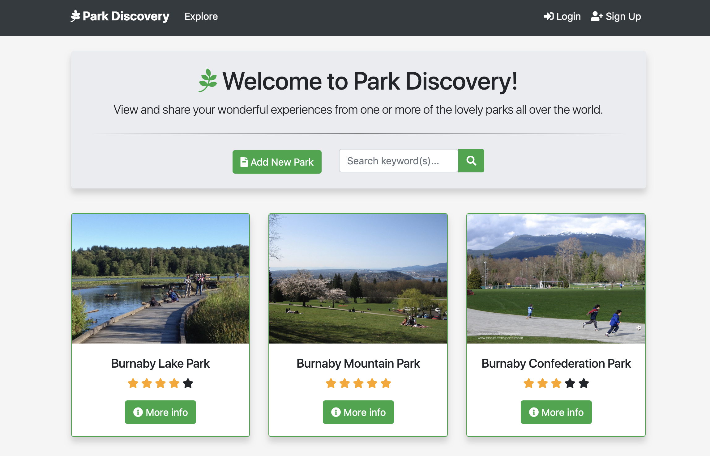

# Park Discovery
> Park Discovery is a fictional full-stack web application for reviewing nature parks using Node.js, ExpressJS, mongoose, passport, RESTful routing, javascript and bootstrap. It is inspired from the Udemy course - [The Web Developer Bootcamp by Colt Steele](https://www.udemy.com/the-web-developer-bootcamp/)




## Live Demo

To see the app in action, go to [https://park-discovery.herokuapp.com](https://park-discovery.herokuapp.com)

**This website is not intended for public use. Please note that all park comments and ratings are randomly generated and some of the data maybe fake.**

## Features

* Authentication:
  
  * User login with username and password

  * User registration

* Authorization:

  * One cannot edit or delete parks, reviews, and comments created by other users without being authenticated

* Manage park posts with basic functionalities:

  * Create, edit and delete parks, reviews, and comments

  * Upload park photos using Amazon S3 (cloudinary)

  * Display park location on Google Maps
  
  * Search existing parks

* Flash messages responding to users' interaction with the app

* Responsive web design

## Getting Started

> This app contains API secrets and passwords that have been hidden deliberately, so the app cannot be run with its features on your local machine. However, feel free to clone this repository if necessary.

### Clone or download this repository

```sh
 clone https://github.com/AceNavarro/ParkDiscovery.git
```

### Install dependencies

```sh
npm install
```

or

```sh
yarn install
```

## Built with

### Front-end

* HTML5
* CSS3
* [ejs](http://ejs.co/)
* [Google Maps APIs](https://developers.google.com/maps/)
* [Bootstrap](https://getbootstrap.com)

### Back-end

* [node](https://nodejs.org/en/)
* [express](https://expressjs.com/)
* [RESTful routing](https://codepen.io/urketadic/details/oZRdRN)
* [mongoDB](https://www.mongodb.com/)
* [mongoose](http://mongoosejs.com/)
* [passport](http://www.passportjs.org/)
* [passport-local](https://github.com/jaredhanson/passport-local#passport-local)
* [express-session](https://github.com/expressjs/session#express-session)
* [method-override](https://github.com/expressjs/method-override#method-override)
* [moment](https://momentjs.com/)
* [cloudinary](https://cloudinary.com/)
* [geocoder](https://github.com/wyattdanger/geocoder#geocoder)
* [connect-flash](https://github.com/jaredhanson/connect-flash#connect-flash)

### Platforms

* [Cloudinary](https://cloudinary.com/)
* [Heroku](https://www.heroku.com/)
* [mLab](https://mlab.com/home)
## License

#### [MIT](./LICENSE.txt)
